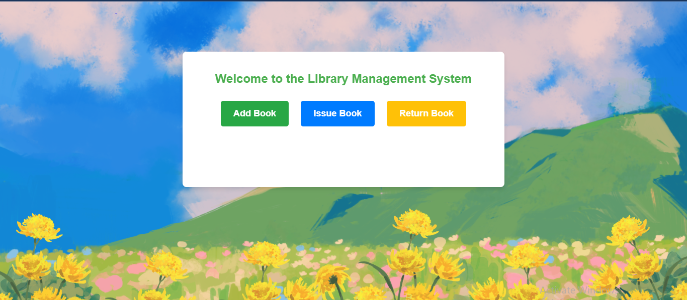

# Library Management System

## Overview
The **Library Management System** is a web application built using Flask for the backend and HTML/CSS for the frontend. It enables users to manage books in a library, including adding, issuing, returning, and searching for books. This project demonstrates fundamental concepts in web development, including routing, template rendering, and basic UI design.

---

## Features
1. **Add Books**: Add new books to the library database.
2. **Issue Books**: Issue books to users and keep track of them.
3. **Return Books**: Record returned books and update their availability.
4. **Search Books**: Search for books by title, author, or ISBN.
5. **Responsive UI**: User-friendly interface styled with CSS.

---

## Project Structure
```plaintext
/library-management-system
├── app.py               # Main Flask application file
├── /static             # Folder for static assets (CSS, images, etc.)
│   ├── styles
│   │   └── style.css  # Styling for the frontend
│   ├── images
│       └── background.png  # Background image for the application
├── /templates          # Folder for HTML templates
│   ├── base.html  # Base template for consistent layout
│   └── index.html # Home page
└── requirements.txt  # Required Python packages
```

---

## Installation

### Prerequisites
1. Python (3.8 or later)
2. pip (Python package manager)

### Steps
1. **Clone the Repository**:
   ```bash
   git clone https://github.com/your-username/library-management-system.git
   cd library-management-system
   ```

2. **Create a Virtual Environment**:
   ```bash
   python -m venv venv
   source venv/bin/activate  # On Windows: venv\Scripts\activate
   ```

3. **Install Dependencies**:
   ```bash
   pip install -r requirements.txt
   ```

4. **Run the Application**:
   ```bash
   python app.py
   ```

5. **Access the Application**:
   Open your browser and go to `http://127.0.0.1:5000`.

---

## Usage
1. Navigate to the homepage.
2. Use the provided buttons to perform actions:
   - **Add Book**: Enter book details and submit.
   - **Issue Book**: Record a book issue to a user.
   - **Return Book**: Update the status of returned books.
   - **Search Book**: Search the library catalog by title, author, or ISBN.

---

## Screenshots

### Home Page


### Add Book Page


---

## Technologies Used
1. **Backend**: Flask (Python)
2. **Frontend**: HTML, CSS
3. **Database**: MySQL

---

## Future Enhancements
1. Add user authentication for admin and regular users.
2. Implement advanced search and filtering options.
3. Enhance the UI with JavaScript for better interactivity.

---

## License
This project is licensed under the [MIT License](LICENSE).

---

## Acknowledgments
Special thanks to the open-source community and Flask documentation for guidance.

---

## Contact
For questions or suggestions, feel free to reach out:
-Email: prachipandeyk85@gmail.com 
-GitHub:(https://github.com/prachi-pandey-github/)

